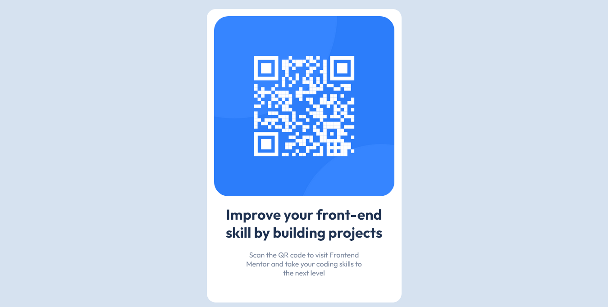

# Frontend Mentor - QR code component solution

This is a solution to the [QR code component challenge on Frontend Mentor](https://www.frontendmentor.io/challenges/qr-code-component-iux_sIO_H). Frontend Mentor challenges help you improve your coding skills by building realistic projects. 

## Table of contents

- [Overview](#overview)
  - [Screenshot](#screenshot)
  - [Links](#links)
- [My process](#my-process)
  - [Built with](#built-with)
  - [What I learned](#what-i-learned)
  - [Continued development](#continued-development)
  - [Useful resources](#useful-resources)
- [Author](#author)
- [Acknowledgments](#acknowledgments)

**Note: Delete this note and update the table of contents based on what sections you keep.**

## Overview

### Screenshot



### Links

- GitHub - [leandrofa1980](https://github.com/leandrofa1980/qr-code-component)
- Site URL - [leandrofa1980-qr-code-component](https://leandrofa1980-qr-code-component.netlify.app/)

## My process

### Built with

- Semantic HTML5 markup
- CSS custom properties

### What I learned

With this challenge I learned more about code organization with identified classes and responsive code.

```html
<main class="qr-code-container">
    <div class="qr-code-background">
      
```
```css
.qr-code-container {
  border-radius: 1.25rem;
  background-color: hsl(0, 0%, 100%);
  padding: 1rem;
  max-width: 100%;
  margin: 1.25rem;
}

@media (max-width: 400px) {

  .qr-code-background {
    width: 300px;
    height: 500px;
    border-radius: 10px;
  }
```

### Continued development

My focus at the moment is on mastering the front-end, I identify a lot in building websites thinking about the design and planning the whole structure.

## Author

- Frontend Mentor - [@leandrofa1980](https://www.frontendmentor.io/profile/leandrofa1980)
- GitHub - [leandrofa1980](https://github.com/leandrofa1980)

